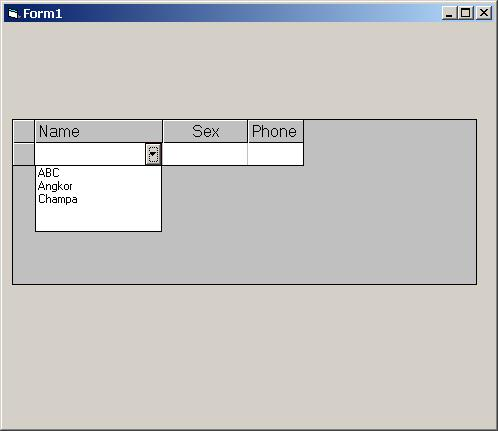



## Database Subform

### Description

Here is a component for a developer who wish to do subform in visual basic. Now, you can download it and did as what you want... This component are include combobox, check box, textbox, and button for making it easy to developed...you also can edit cell column, and manything according to Subform...Please, feel free to send me if you have any comment or any question regarding to this component.
 
### More Info
 
You must know how to use flexgrid before you starting using this code.cos, it's look like flexgrid

             |
---                |---
**Submitted On**   |2005-08-15 06:20:04
**By**             |[So Sereyroath](https://github.com/Planet-Source-Code/PSCIndex/blob/master/ByAuthor/so-sereyroath.md)
**Level**          |Advanced
**User Rating**    |4.3 (13 globes from 3 users)
**Compatibility**  |VB 5\.0, VB 6\.0
**Category**       |[OLE/ COM/ DCOM/ Active\-X](https://github.com/Planet-Source-Code/PSCIndex/blob/master/ByCategory/ole-com-dcom-active-x__1-29.md)
**World**          |[Visual Basic](https://github.com/Planet-Source-Code/PSCIndex/blob/master/ByWorld/visual-basic.md)
**Archive File**   |[Database\_S1924098152005\.zip](https://github.com/Planet-Source-Code/so-sereyroath-database-subform__1-62194/archive/master.zip)

